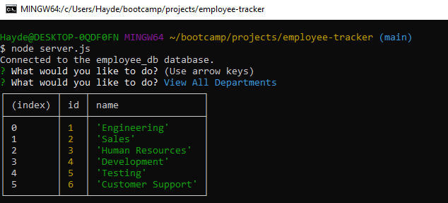

# employee-tracker
  
  
  ## Video Link
  

  

  ## Description
  This app allows users to connect to a database to access employee information. You are able to view, add, and delete department, role, and employee information, update an employees role/manager, view employees by department or manager, and view the total budget of a department. 

  ## Usage
  To use the app node is required to run the JS application locally. After installing node use the command npm i to install dependencies, and the command node server.js to launch the server and application.

  ## License
    This README generator is licensed under the [MIT License](https://opensource.org/licenses/MIT)
  

  ## Badges
  

  ## Questions
  Feel free to reach out and contact me with any questions you may have.
  - GitHub: [Kyle-H](https://github.com/Kyle-H)
  - Email: dahaydnator@gmail.com
